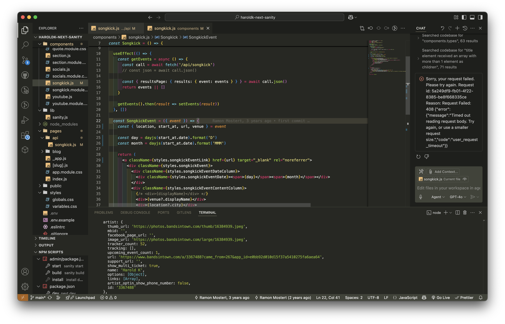
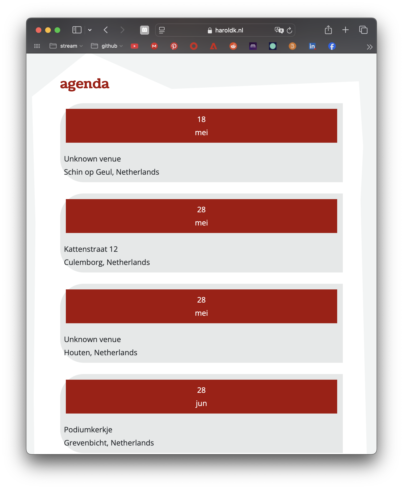

# Wat heb je vandaag gedaan?
## #HaroldK
ik heb verder gewerkt aan de website van HaroldK

ik​ heb veel gekeken naar hoe ik de api kan veranderen van een agenda die er staat. Dit is hoe het er nu uit ziet.

Deze wil ik wijzigen met de *bandsingtown* api. Ik krijg het alleen nog steeds niet aan de praat.
# Wat zijn #handige-dingen die je hebt gevonden of geleerd?
## linkedin links
ik heb een aantal dingen gevonden op #linkedin, dit zijn een aantal interessante posts die ik nog wil inlezen. hieronder kan je een lijstje vinden van deze dingen, voordat ik het vergeet.... 
- [site of the day](https://www.linkedin.com/posts/greensock_site-of-the-day-quechua-ss25-lookbook-activity-7322755966960099329-FUfn?utm_source=share&utm_medium=member_desktop&rcm=ACoAADtV6GgBkjOrbmNyJquqp06WzzYRyuV9180)
- [semantic html](https://www.linkedin.com/feed/update/urn:li:activity:7322592927338135553/?updateEntityUrn=urn%3Ali%3Afs_updateV2%3A%28urn%3Ali%3Aactivity%3A7322592927338135553%2CFEED_DETAIL%2CEMPTY%2CDEFAULT%2Cfalse%29)
- [canva code vs developers](https://www.linkedin.com/posts/latoyanijmeijer_canva-code-vs-developers-the-beginning-activity-7317646650712162305-22Gz/?utm_source=share&utm_medium=member_desktop&rcm=ACoAADtV6GgBkjOrbmNyJquqp06WzzYRyuV9180)

## gsap is gratis!!
oja en *gsap* is ==gratis==!!!! Ik wil hier binnenkort wat meer oefeningen in doen.