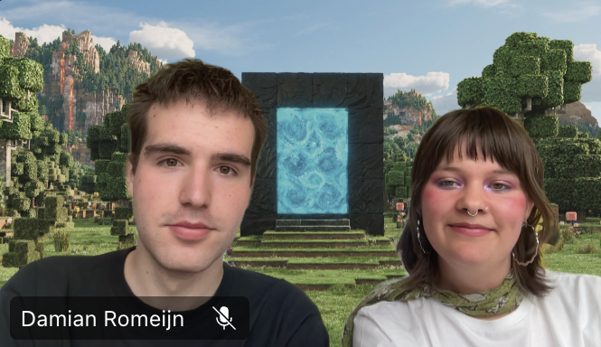
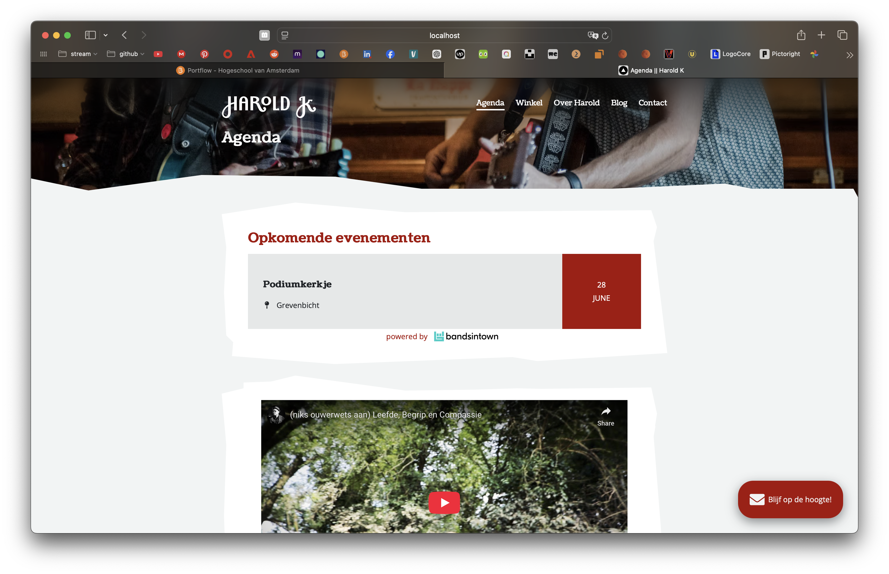

# Wat ben je van plan om vandaag te doen?
- [ ] kijken naar de planning van [[weekrapport-2|weekrapport-2]]. wat moeten we na de vakantie doen?
	- [ ] Damian had het erover dat we onze log misschien kunnen samenvoegen. Dat vind ik opzich wel handig omdat we dan gemakkelijk kunnen inzien wat we allemaal hebben gedaan. Hier moeten we een oplossing voor verzinnen.
	- [x] een duidelijke planning maken. wanneer gaan wij aan Visual Thinking? wanneer aan ons eigen project?
		- [x] lijkt me het beste om donderdag en vrijdag sowieso aan Visual thinking te gaan.
	- [ ] We moeten *echt* de handover en *backlog* lezen
	- [x] het refactoren af hebben
	- [ ] doorgaan met de huidige opdracht
	- [ ] het project board goed zetten.
# Wat heb je vandaag gedaan?

## algemeen
* we hadden een stand-up gehad
* we hadden stickers gemaakt
## planning maken
Damian en ik freestlyde eerst erg veel over de planning. Wij hebben nu het volgende afgesproken over de planning:
* maandag en dinsdag zijn zelfstudie dagen, wat inhoud dat wij ons eigen projecten doen.
* woensdag, donderdag en vrijdag werken wij daar aan *project visual*.
## #HaroldK
* Ik heb *eindelijk* de API kunnen invoegen voor harold. Deze heb ik ook gestijld. Ik wil deze binnenkort mergen

Deze api is nu vervangen van `songkick`, naar de `bandsingtown` api. 
* [ ] beschrijf hoe je dit hebt aangepakt dat je tot dit resultaat bent gekomen. 
# Wat zijn #handige-dingen die je hebt gevonden of geleerd?
* vandaag had ik perongeluk code gepushed die niet gepushed moest worden. wij kwamen er uiteindelijk achter dat we de volgende code kunnen gebruiken om dit terug te draaien:
```terminal
git reset --hard <commit>
git push --force
```
* robin liet mij vandaag een webiste zien genaamd [anime.js](https://animejs.com/documentation/timer/timer-callbacks). Ik wil hier meer ontwikkelingen. mee documenteren en gaan kijken of ik dit kan implenmenteren op m’n portfolio 
* https://www.dora.run/
	* https://3d-hatduck.dora.run/
# Wat zijn jou plannen voor morgen?
* verder werken aan m’n portfolio
* een aantal oefeningen doen over bijvoorbeeld gsap, maar ook andere dingen
* eventueel linkjes lezen over een aantal leuke weetjes
* misschien even vragen hij ik obsidian kan opdragen als bewijslast?
# plannen voor later

## #HaroldK
* ik wil voor dit project goed de workflow conventies aanhouden. dus met deze structuur werken
* eventueel gaan refactoren. en meer custom properties invoegen en gebruiken. die missen namelijk nog te veel. 
* zorg dat je alle dingen die je hier noteerd ook op github zet binnenkort. 