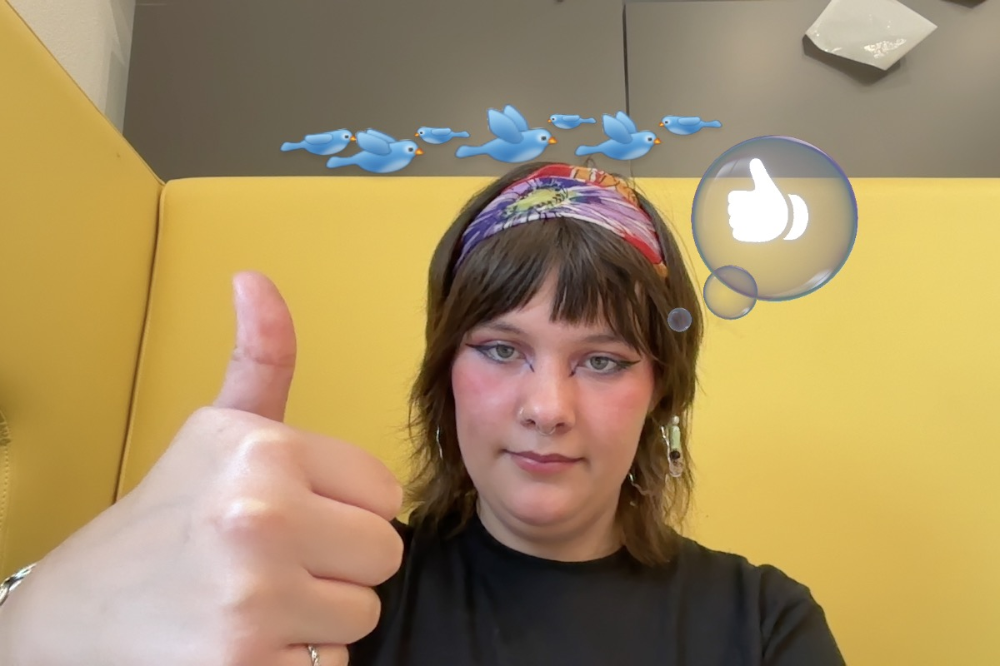

# Wat ben je van plan om vandaag te doen?
* ik wil verder werken aan mijn portfolio
# Wat heb je vandaag gedaan?
## visual thinking
- [notities](https://github.com/fdnd-agency/visual-thinking/issues/373) gemaakt over de presentatie van Sander
## portfolio
* ik heb veel onderzoek gedaan naar de vormgeving en allerlei borden gemaakt via [figma](https://www.figma.com/design/sa6gKzG7UfFY3K8qBcb8cc/portfolio?node-id=0-1&t=KF7ypqFhjivPezFH-0)
* Ik ben ook begonnen met coderen op een branch

# Heb je alles kunnen doen wat je *gisteren* voor ogen had?

* [x] verder werken aan m’n portfolio
* [ ] een aantal oefeningen doen over bijvoorbeeld gsap, maar ook andere dingen
* [ ] eventueel linkjes lezen over een aantal leuke weetjes
* [ ] misschien even vragen hij ik obsidian kan opdragen als bewijslast?
# Wat zijn handige dingen die je hebt gevonden of geleerd?
# Wat zijn jou plannen voor morgen
