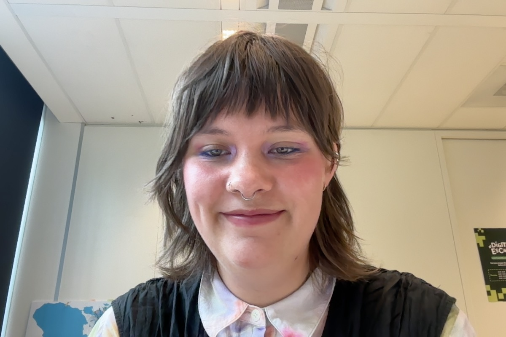

# Wat ben je van plan om vandaag te doen?
- zie deze stand-up
# Wat heb je vandaag gedaan?
### #Visual-thinking
- ik ben [begonnen](https://github.com/orgs/fdnd-agency/projects/7/views/14?pane=issue&itemId=107934777&issue=fdnd-agency%7Cvisual-thinking%7C365) met het bouwen van het filter systeem in Visual thinking
	- veel onderzoek gedaan over de code en hoe het is gebouwd
		- Hiervoor heb ik de volgende [commits](https://github.com/fdnd-agency/visual-thinking/commits/feature-csr-filter-%23365/?since=2025-05-07&until=2025-05-08) gemaakt
	- en heb ik een issue aan damian geschreven met een [uitleg](https://github.com/fdnd-agency/visual-thinking/issues/365#issuecomment-2863163129) over hoe het ophalen van data werkt
- ook hebben we het projectboard wat opgeschoond. 
- hebben sander wat meer uitgelegd over het project
# Wat zijn #handige-dingen die je hebt gevonden of geleerd?
* ik had [deze](https://github.com/fdnd-agency/visual-thinking/issues/365#issuecomment-2863319023) link gevonden waarbij er een vormgeving word laten zien over de checkboxes
# Wat zijn jou plannen voor morgen
- [ ] verder werken aan de checkboxes
- [ ] meer inlezen over artikelen voor internationale ontwikkelingen 
- [ ] code review
- [ ] oude issues bekijken?