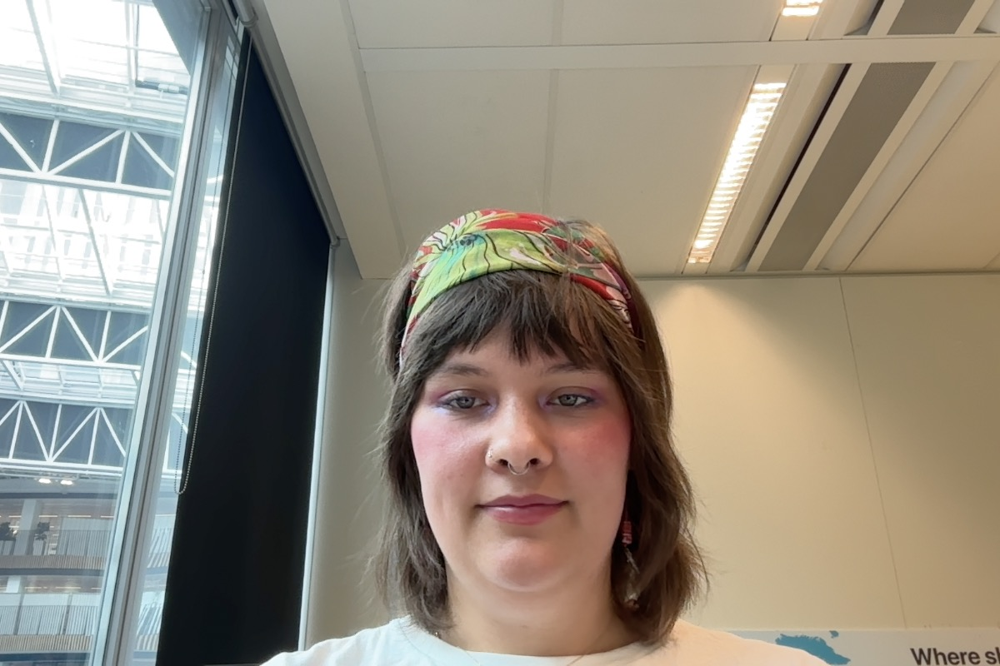

Vandaag zijn wij net begonnen met _fdnd agency_.

### Ik heb aan de volgende dingen gewerkt:
- Visual thinking
- Haroldk project
- Eigen ontwikkelingen

# Visual thinking
- Hebben het project opgehaald. We hadden per ongeluk het geforked, inmiddels hebben Damian en ik dat opgelost. 
- We hebben het [project board](https://github.com/orgs/fdnd-agency/projects/7/views/14) aangepast. Deze was onoverzichtelijk.
	- We hebben nu een [progress view](https://github.com/orgs/fdnd-agency/projects/7/views/13)
	- Een [MosCow](https://github.com/orgs/fdnd-agency/projects/7/views/6)
	- En een my task, waar jij je eigen [task](https://github.com/orgs/fdnd-agency/projects/7/views/9) kan vinden
	- Verder zijn we ook bezig met een [planning](https://github.com/orgs/fdnd-agency/projects/7/views/14)
- Ook hebben we naar refactor issues gekeken alvast, wat wij kunnen gaan corrigeren

#### Wat willen we morgen doen?
* [x] We hebben de issues overgeplaatst naar de originelen repo, maar hiervoor moeten we de comments nog goed zetten van de oude issues
* [ ] We willen gaan beginnen met het refractoren van de code zover als mogelijk
* [x] We willen de dependencies meer up-to-date
* [ ] Naamgeving van branches goed verdelen, schrijf [workflow](https://github.com/fdnd-agency/visual-thinking/issues/302#issue-2993036212) even af.

# HaroldK
- Ik had met iemand van software development gekeken naar de code, het lijkt erop dat ik de api makkelijk kan vervangen met diegene van bandsingtown.
- Wel vraag ik mij af hoe ik de code ga vertalen en of het toch niet te moeilijk word, dus misschien moet ik ga nadenken om de het project over te dragen aan school om het opnieuw op te gaan bouwen.

## Wat moet ik doen?
- *Bandsingtown* verder werkend krijgen
- Hoe maak ik het tweetalig?

# Eigen ontwikkelingen
Ik had nog een video gekeken van [Frontend news](https://youtu.be/Po86wXWmPSI?feature=shared)
- hier word de fill-stroke property gebruikt, ik vond dit er heel vet uit zien

Misschien gebruiken voor portfolio? Lijkt me leuk om te animeren in deze [sectie](https://youtu.be/Po86wXWmPSI?t=19&feature=shared) van de video kan je alles erover vinden