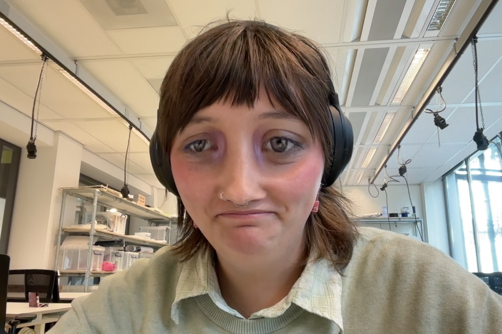
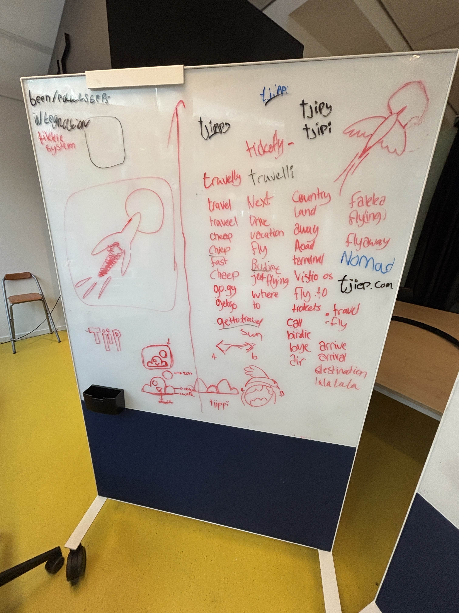
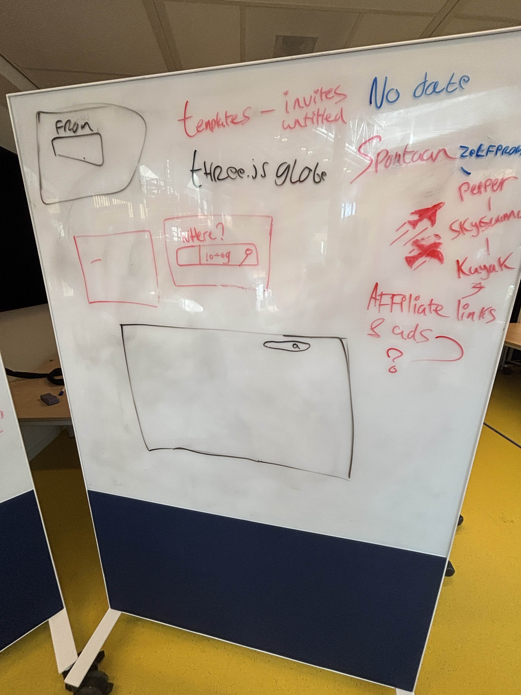

> ik wil github activiteiten hierbij zetten om te zien welke issues enzo ik voor vandaag heb gemaakt net als commits en etc
# ​Wat ben je van plan om vandaag te doen?
- hier kan je de [stand-up](https://github.com/fdnd-agency/visual-thinking/issues/394) vinden
# Wat heb je vandaag gedaan?
* ik heb verder gewerkt aan deze [issue](https://github.com/fdnd-agency/visual-thinking/issues/365) waarbij ik werk om een website `csr` te maken
* Ik heb feedback gegeven aan Sander zijn Figma bestand. Hieronder kan je alle comments vinden:
	* [comment #15](https://www.figma.com/design/IA8kp0MG1STYNqoFDIbuVj?node-id=0-1#1258015700)
	* [comment #14](https://www.figma.com/design/IA8kp0MG1STYNqoFDIbuVj?node-id=124-2#1258014457)
	* [comment #13](https://www.figma.com/design/IA8kp0MG1STYNqoFDIbuVj?node-id=111-829#1258013154)
	* [comment #12](https://www.figma.com/design/IA8kp0MG1STYNqoFDIbuVj?node-id=0-1#1258010794)
	* [comment #11](https://www.figma.com/design/IA8kp0MG1STYNqoFDIbuVj?node-id=28-548#1258009502)
	* [comment #10](https://www.figma.com/design/IA8kp0MG1STYNqoFDIbuVj?node-id=25-331#1258008322)
	* [comment #09](https://www.figma.com/design/IA8kp0MG1STYNqoFDIbuVj?node-id=15-3#1258007521)
	* [comment #08](https://www.figma.com/design/IA8kp0MG1STYNqoFDIbuVj?node-id=3-204#1258006656)
	* [comment #07](https://www.figma.com/design/IA8kp0MG1STYNqoFDIbuVj?node-id=264-10#1258006082)
	* [comment #06](https://www.figma.com/design/IA8kp0MG1STYNqoFDIbuVj?node-id=264-10#1258004936)
	* [comment #05](https://www.figma.com/design/IA8kp0MG1STYNqoFDIbuVj?node-id=264-10#1258004250)
	* [comment #04](https://www.figma.com/design/IA8kp0MG1STYNqoFDIbuVj?node-id=264-10#1258003942)
	* [comment #03](https://www.figma.com/design/IA8kp0MG1STYNqoFDIbuVj?node-id=264-10#1258003543)
	* [comment #02](https://www.figma.com/design/IA8kp0MG1STYNqoFDIbuVj?node-id=264-10#1258003229)
	* [comment #01](https://www.figma.com/design/IA8kp0MG1STYNqoFDIbuVj?node-id=264-10#1258002404)
* Wij hebben vandaag gewerkt aan een concept van een website waar we aan willen werken

* Ik heb een gesprek gehad met de ITK, Chris en ik willen hiervoor samen bewijslast schrijven.
# Wat zijn #handige-dingen die je hebt gevonden of geleerd?
- je kan in github in een issue een branch maken? bij development?! Misschien even doen

# Wat zijn jou plannen voor morgen
verder werken aan visual thinking