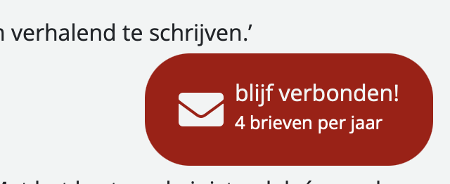

# Wat heb ik gepland voor vandaag?
- bespreken van het project met Harold
- Eerstejaars helpen
- Doorwerken aan `IconLibrary`
# Wat heb ik vandaag gedaan?
## Eerstejaars helpen
De dag begon waarbij ik de eerstejaars ging helpen hierbij heb ik een aantal eerste jaars geholpen. Hierbij heb ik ook een aantal algemene notaties gemaakt. Ik ging helpen te kijken naar performance, zij gingen hun werk presenteren. Waarna ik issues bij hun ging neerzetten over dit project. Ik heb de volgende studenten geholpen:

| Documentatie van eerstejaars                                                                         | feedback van mij                                                     |
| ---------------------------------------------------------------------------------------------------- | -------------------------------------------------------------------- |
| [Viresh Sheoratan](https://github.com/vsheo/performance-audit/wiki/Performance-Audit)                | [Issue](https://github.com/vsheo/performance-audit/issues/1)         |
| [Amber Schalker](https://github.com/ambersr/performance-audit)                                       | [Issue](https://github.com/ambersr/performance-audit/issues/1)       |
| [Julia Stevens](https://github.com/julia-stevens/performance-audit/wiki/Deeltaak:-Performance-Audit) | [Issue](https://github.com/julia-stevens/performance-audit/issues/1) |
|                                                                                                      |                                                                      |
### algemene notities
Naast dat ik hun opmerkingen had gegeven over hun werk, had ik ook algemeen wat meegegeven aan hun:
____
Hier zet ik even wat algemene notaties voor jullie alle drie neer. Handige dingen die goed zijn om mee te nemen die mij opvielen.

**Werk semantisch**! als je naar deze sites kijkt, zie je vaak dingen als veel `css`. Dingen als:
* veel `div` elementen, waardoor er veel classes ontstaat  
  * dit zorgt ervoor dat de sheets veel langer worden dan hoort. Werk dus gestructureerd. Doen jullie vast wel, maar nu zie je waarom het dus zo belangrijk is <3
  * ik had toevallig gisteren een artikel gevonden hoe je het zou kunnen [structureren](https://developer.mozilla.org/en-US/docs/Learn_web_development/Core/Styling_basics/Organizing#create_logical_sections_in_your_stylesheet). Erg handig :) 
* Gebruik custom properties. Zijn we net niet erg op in gegaan. Maar ook zooo handig, dan heb je een plek waar alles staat. 
* ook wat viresh zei, was erg goed. Als je selectors hebt die allemaal dezelfde property gebruiken, kan je ze ook samenvoegen

_in plaats van dit:_
``` css
h1 {
background-color: #000000;
}
h2 {
background-color: #000000;
}
```
_doe je dit:_
```css
h1, h2 {
background-color: #000000;
}
```  
* op heel veel sites zie je dat dingen worden geëxporteerd van externe sites. dingen van Google bijvoorbeeld of bijvoorbeeld afbeeldingen
  * dit kan er op komen dat de laadtijd dus ook langer word. Dus je zou dan kunnen kijken wat nou _echt_ geïmporteerd kan worden en wat je dus lokaal kan laten staan. 

# HaroldK
Vandaag heb ik met harold gesproken over het project. #sprint-review
- ik had de [knoppen veranderd](https://github.com/SamaraFellaDina/haroldk-next-sanity/issues/25), waardoor het meer persoonlijk werd. 
	- Dit was uiteindelijk de knop:
	  
	- Nadat ik deze knop had laten zien, hebben we samen gekeken naar de vormgeving hiervan. 
	  
	  Dit is uiteindelijk de knop geworden. Ik wil alleen kijken of ik een hover animatie kan maken waarbij als je eroverheen gaat, de tekst eronder er verschijnt. 
		- [ ] Zorg dat deze knop nog een shaduw krijgt.
		- [ ] Voeg de hover animatie toe.
- verder waren we ook nog aan het kijken hoe ik de data aan pas. Hier loop ik al een aantal dagen tegen aan. Omdat ik nooit met sanity heb gewerkt. Inmiddels is het mij dankzij Robin gelukt om hiermee verder te komen. Wij hebben samen de link gevonden waar we de data kunnen aanpassen. #jippiemoment
  
#### waar ga ik verder aan werken?
* ik ga de agenda aanpassen
* #idea we zijn aan het kijken om een perskit te maken, waarbij er een knop is waar je de content kan downloaden van de site. Hierin zit Harolds content. dingen als foto's, tekst en meer
	* Dit is nog een idee. maar ik zou er onderzoek naar kunnen doen
* De kalender implenmenteren
* Nu ik toegang heb tot de data, kan ik ook gaan kijken hoe ik alles kan gaan vertalen.
* De mailknop aanpassen
	* 
		- [ ] Zorg dat deze knop nog een shaduw krijgt.
		- [ ] Voeg de hover animatie toe.