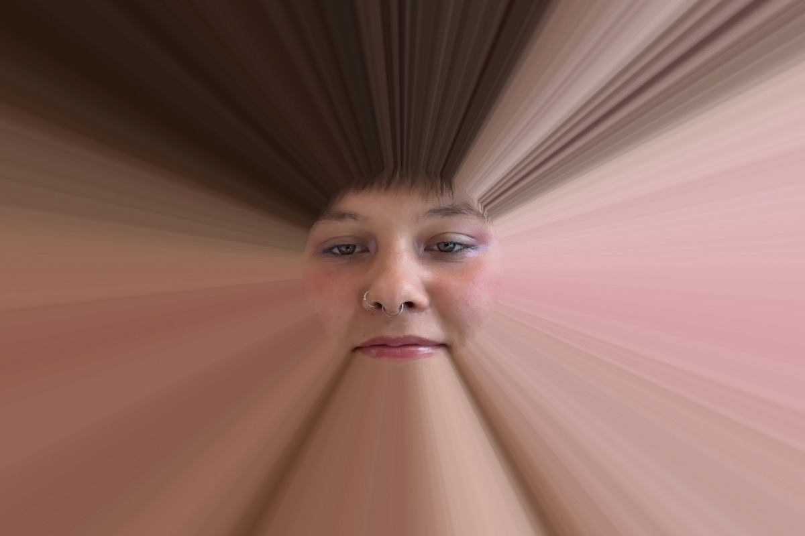
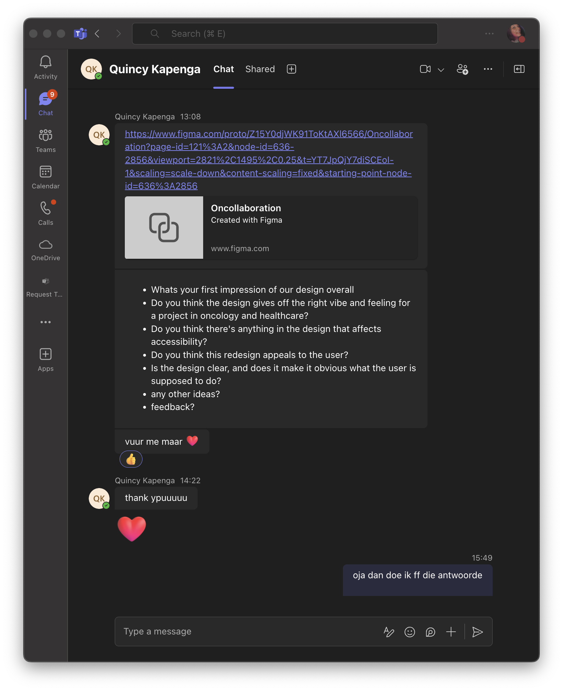
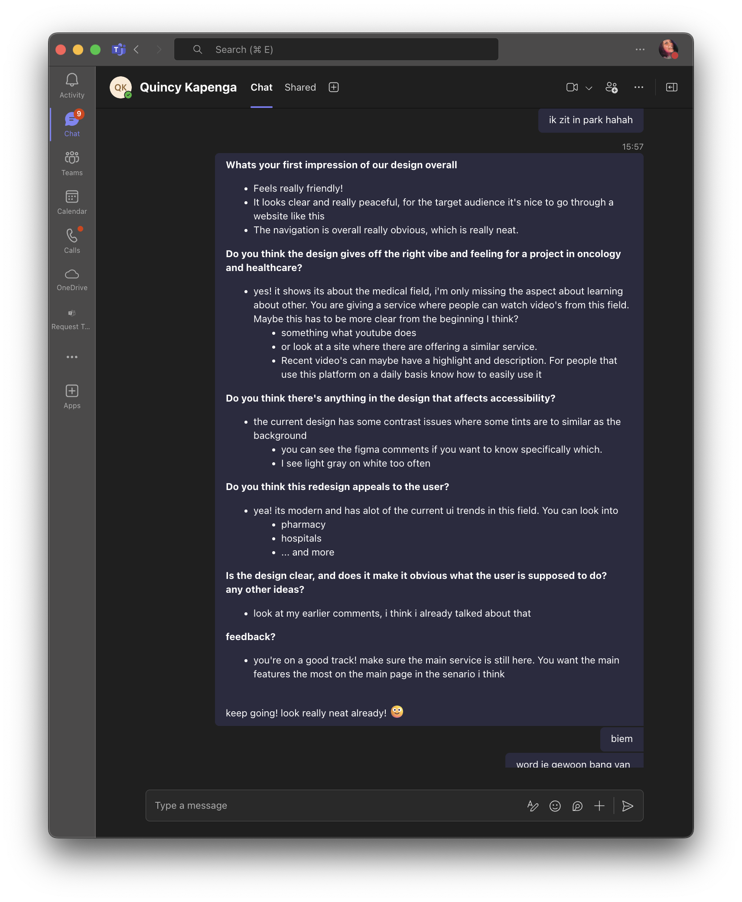

# Wat ben je van plan om vandaag te doen?
zie deze issue
# Wat heb je vandaag gedaan?
* het is mij gelukt om een filter te maken! hier kan je de [issue](https://github.com/fdnd-agency/visual-thinking/issues/365) vinden daarvoor
* ik heb verder meerdere reviews gegeven voor meerdere projecten om naar te kijken
* Ik heb ook een figma schets gemaakt voor [Damian](https://github.com/fdnd-agency/visual-thinking/issues/395)
> misschien betere kwaliteit foto's erin zetten
## feedback voor Quincy
ik heb feedback gegeven aan Quincy zijn design. Hiervoor heb ik de volgende vragen beantwoord:

| Question                                                                                                          | Awnser I have given                                                                                                                                                                                                                                                                                                                                                                                                                                                                               |
| ----------------------------------------------------------------------------------------------------------------- | ------------------------------------------------------------------------------------------------------------------------------------------------------------------------------------------------------------------------------------------------------------------------------------------------------------------------------------------------------------------------------------------------------------------------------------------------------------------------------------------------- |
| **Whats your first impression of our design overall**                                                             | - Feels really friendly!  - It looks clear and really peaceful, for the target audience it's nice to go through a website like this - The navigation is overall really obvious, which is really neat.                                                                                                                                                                                                                                                                                       |
| **Do you think the design gives off the right vibe and feeling for a project in oncology and healthcare?**        | - yes! it shows its about the medical field, i'm only missing the aspect about learning about other. You are giving a service where people can watch video's from this field. Maybe this has to be more clear from the beginning I think?   - something what youtube does   - or look at a site where there are offering a similar service.    - Recent video's can maybe have a highlight and description. For people that use this platform on a daily basis know how to easily use it |
| **Do you think there's anything in the design that affects accessibility?**                                       | - the current design has some contrast issues where some tints are to similar as the background   - you can see the figma comments if you want to know specifically which.    - I see light gray on white too often                                                                                                                                                                                                                                                                         |
| **Do you think this redesign appeals to the user?**                                                               | - yea! its modern and has alot of the current ui trends in this field. You can look into     - pharmacy   - hospitals   - ... and more                                                                                                                                                                                                                                                                                                                                                |
| **Is the design clear, and does it make it obvious what the user is supposed to do?**  **any other ideas?** | - look at my earlier comments, i think i already talked about that                                                                                                                                                                                                                                                                                                                                                                                                                                |
| **feedback?**                                                                                                     | - you're on a good track! make sure the main service is still here. You want the main features the most on the main page in the senario i think                                                                                                                                                                                                                                                                                                                                                   |

Ik heb ook een aantal comments achtergelaten in figma om het design wat feedback te geven. 

* [comment](https://www.figma.com/design/Z15Y0djWK91ToKtAXl6566?node-id=588-64#1259949401) 1
* [comment](https://www.figma.com/design/Z15Y0djWK91ToKtAXl6566?node-id=588-64#1259948543) 2
* [comment](https://www.figma.com/design/Z15Y0djWK91ToKtAXl6566?node-id=588-64#1259902921) 3
* [comment](https://www.figma.com/design/Z15Y0djWK91ToKtAXl6566?node-id=588-64#1259898578) 4
* [comment](https://www.figma.com/design/Z15Y0djWK91ToKtAXl6566?node-id=588-64#1259897183) 5
* [comment](https://www.figma.com/design/Z15Y0djWK91ToKtAXl6566?node-id=588-64#1259895743) 6

## feedback voor Lesley
Lesley vroeg eerder deze week om [vragen](https://github.com/orgs/fdnd-agency/projects/35/views/1?pane=issue&itemId=109280512&issue=fdnd-agency%7Concollaboration%7C98) in te vullen over zijn design

| vragen                                                                            | antwoorden                                                                                                                                                                                                                                                                                                                                                                                           |
| --------------------------------------------------------------------------------- | ---------------------------------------------------------------------------------------------------------------------------------------------------------------------------------------------------------------------------------------------------------------------------------------------------------------------------------------------------------------------------------------------------- |
| Wat voor gevoel krijg je bij het kijken naar het design ?                         | - de header heeft erg veel ruis. Ik zou de simpelere versies van de logo's gebruiken met alleen het beeld. Al helemaal voor mobiel - ik vind het erg fijn dat de video's duidelijk zijn hier. Alleen de afbeeldingen zijn nu afgesneden waardoor de tekst van de thumbmail eruitvalt - de filters zijn heel erg nice! Voor mobiel zou ik naar een manier kijken om dat overzichtelijk te maken |
| Hoe is het ten opzichte van het oude design ?                                     | Al veel beter! ik vond het kleurgebruik bij de vorige designs te heftig. Hier zoek je al wat meer de kalmte op. Fijn om te zien!                                                                                                                                                                                                                                                                     |
| Wat vindt je van de keuzes van de kleuren ?                                       | Je bent op de goede weg. Ik zou allee nog kijken om de filters nog ietsje rustiger te krijgen. Dat word denk ik iets te veel. Maar het is ook niet erg storend. Het is al veel beter dan de vorige designs                                                                                                                                                                                           |
| Vindt je dat deze re-design de gebruiker aanspreekt ?                             | jaa zeker! ik vind het goed bij die sector passen en het straalt medisch/serieus uit! Zou ook zeker naar medische sites kijken als apotheken (zoals BENU), huisartsen en meer.                                                                                                                                                                                                                       |
| Welke gedeelte van het design spreekt jou het meest aan ?                         | dat je de nieuwste video meteen ziet. Ik denk dat het erg handig is voor de meeste gebruikers van deze sites. waarschijnlijk omdat ze dit doorlopend bekijken                                                                                                                                                                                                                                        |
| Welke gedeelte van het design spreekt jou minder aan ?                            | Ik vind de subtitel bij de video's erg onduidelijk. Ik zie sowieso dat er veel grijs op wit word gebruikt in de designs                                                                                                                                                                                                                                                                              |
| Zijn de elementen binnen de pagina die de aandacht punt moeten hebben duidelijk ? | Ik denk dat de main focus erg duidelijk is op de pagina's                                                                                                                                                                                                                                                                                                                                            |
| Is het design duidelijk en wat je zou moeten kunnen doen als gebruiker ?       | jaaa zeker! het is erg overzichtelijk                                                                                                                                                                                                                                                                                                                                                                |
| Zijn er toevoegingen die je zou willen zien aan de pagina ?                       | Misschien het aantal likes en comments? Of een foto van de professor?                                                                                                                                                                                                                                                                                                                                |
|                                                                                   |                                                                                                                                                                                                                                                                                                                                                                                                      |
