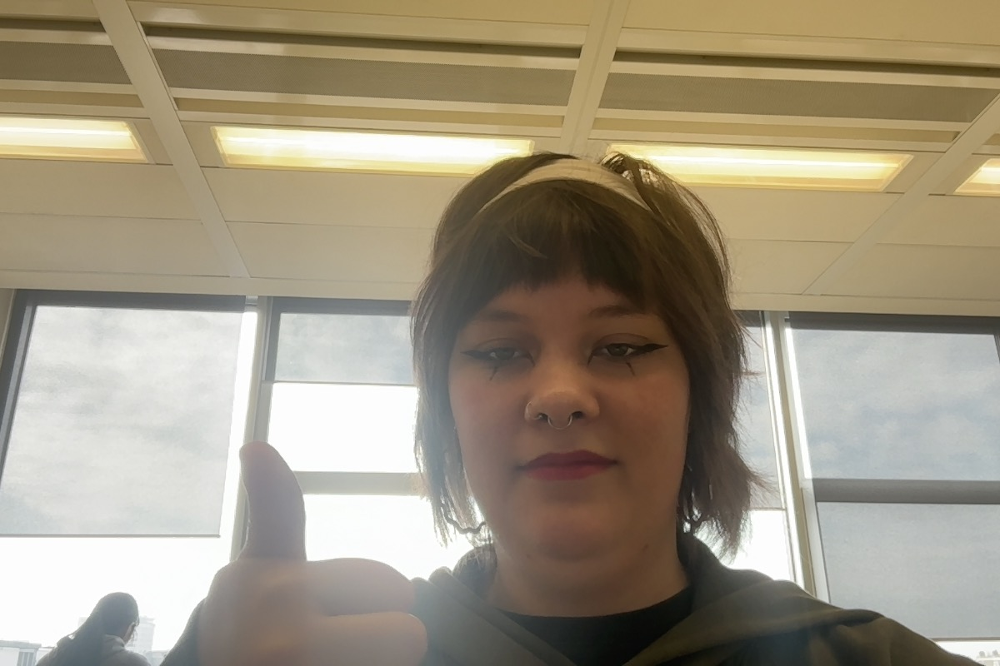

# Wat ben je van plan om vandaag te doen?
* visual thinking
	* werken aan vragen voor charley
* haroldK
	* werken met api
	* dataset maken
	* werken aan feedback van *vorige week*
# Wat heb je vandaag gedaan?
## ik heb stickers gemaakt

## terugkoppeling naar feedback van nadira
Ik had maandag feedback gegeven aan Nadira haar code. ik vroeg mij alleen af waarom zij twee `css` stylesheets gebruikte. ik had nog even aan koop gevraagd hoe dat zat en het nog even eronder [beschreven](https://github.com/Naddybsx/user-experience-enhanced-website/issues/5#issuecomment-2823587305)
# visual thinking
we hebben vandaag heel erg veel code gerefactored en dit samengevoegd met onze `dev` branch. hiervan hebben wij een [*pull-request*](https://github.com/fdnd-agency/visual-thinking/pull/342) gemaakt.
## gesprek met joost
we hadden voor vandaag een gesprek met joost op de planning staan, waarin we de orientatie van het project gingen door spreken.  hierin kwamen een aantal dingen naar voren: 
* de `main` is niet up to date met de `release-candidate` wat inhoud dat wij op oude code hebben zitten refactoren. Dus meoten wij nu dit samenbrengen met deze code. terwijl wij zelf ook code hebben geschreven, die is gebasseerd op de code van `main`
* wij moeten onze workflow veranderen. We moeten namelijk de naamgeving van onze branches iets wijzigen. deze moet worden gebasseerd op de code conventies van [*fdnd-agency*](https://github.com/fdnd-agency/.github/wiki/Workflow-conventions)
	* We moeten nog meer met feature werken naast onze branches
	* Dan heb je feature en release branches
### stappenplan
1. Release candidate moet gemerged worden met dev, en terug. 
2. Nieuwe release maken naar de main (1.0)
3. Oude branches archiveren
4. updaten naar `svelte 5`
### opdracht
wij hebben verder een opdracht gekregen van Joost dat wij verder gaan werken aan de pagina: ["tekenmethodes"](https://visualthinking.school/tekenmethodes)

op deze pagina is namelijk een filter functie. deze moet meer PE worden. Door het gebruik van `svelte 5`, kan dit soepeler. 
* het filtersysteem moet `server-side` worden. waarbij je direct resultaten krijgt. Nu moet de website vaak laden voor resultaat. Dit kan dus anders
	* ook werd het voorbeeld genoemd van de website waar Robin en Anna-Kyra mee werken. Zij hebben [hier](https://atlas4045.dev.fdnd.nl/adressen/) ook een server-side filtersysteem gemaakt.
	* het zou leuk zijn als we bij het filtersysteem inspiratie kunnen op doen van websites als:
		* funda
		* zalando
		* h&m
		* ... en zo door
	* We kunnen samen met de CMD'er onderzoek doen wat hierbij de beste aanpak is 
	* ook moeten we kijken op welke waarde we kunnen filteren naast de bestaande waardes. 
* naast dat er een filtersysteem moet komen, zie je meerdere pagina's waarbij je een overview hebt van verschillende onderwerpen. We willen hiervoor dezelfde interface maken. Dat deze view globaal hetzelfde eruit ziet.

hier zie je dat er verschillende overviews zijn met detailpagina's, maar ze zien er allemaal anders uit. Zorg dat je hiervoor een globale stijling kan maken
### de branches mergen
Eerder vertelde ik dat we op de verkeerde branch hebben gewerkt, dus we nu onze gerefactorde code moeten combineren met de eerder gemaakte code op de `release candidate`. Wij hebben de volgende dingen gedaan: 

1. wij hebben als eerst `release-candidate` proberen te mergen in `dev`, om daarna te debuggen. Wij merkte al snel dat dit niet de meest ideale oplossing was. we hadden een [*pull-request*](https://github.com/fdnd-agency/visual-thinking/pull/347) gemaakt, maar merkte dat er te veel conflicten waren waar we diep in moesten duiken. 
	1. ik dacht dat het misschien handig was om eerst op een aparte [branch](https://github.com/fdnd-agency/visual-thinking/commits/dev-merge-%23348/) te werken en het daar eerder te vergelijken voordat we het mergen. maar het werkte niet zo soepel, dus had ik die stop gezet
2. daarna hebben we het andersom geprobeerd te doen, dat ging ietsje beter, maar nog steeds erg moeilijk. aangezien je deels andermans werk aan het weghalen bent. Robin en Anna-kyra hadden hiervoor aan het project gewerkt. Hun features, gerefactorde code en meer zou dan verdwijnen. Wij hadden hiervoor ook een [pull-request](https://github.com/fdnd-agency/visual-thinking/pull/349) aangemaakt om te kijken hoe het mergen zou gaan.
	1. Ik had bedacht om dan even een aparte [branch](https://github.com/fdnd-agency/visual-thinking/commits/dev-release-candidate-merge-%23348/) te maken waar ik deze twee branches van te voren anders combineer, om zo goed alle fouten te kunnen zien. 
3. we merkte al snel dat dit te veel werk zou kosten. en wouden ook niet hun harde werk weghalen, dus hadden wij bedacht om ons werk in te voegen op hun werk. Hierbij moeten wij met de volgende dingen rekening houden
	* [ ] staan de global.css naamgeving en kleuren goed?
		* [ ] staan deze kleuren goed verdeeld onder het document? 
	* [ ] is de `index.js` ingevoegd? staat deze overal goed? word alles netjes geimporteert? 
	* [ ] staat de `icons.svelte` er goed in? Kunnen overbodige `svg`'s worden weggehaald?
	* [ ] ... meer volgt
# Heb je alles kunnen doen wat je *gisteren* voor ogen had?
* ik wou erg graag aan mijn *Haroldk* project gaan werken, maar door vandaag ging dat helaas niet.
	* misschien kan ik er vrijdag aan verder werken?
# Wat zijn handige dingen die je hebt gevonden of geleerd?
* ik weet nu hoe ik stickers moet printen en hoe ik op kleding kan drukken.
# heb je nog leuke ideeën? 
Ik zit erover na te denken om deze log om te zetten in een kalender, of hier ook echt een blog van te maken. Ik hoop dat ik daar misschien aan toe kom. 
### Wat zijn jou plannen voor morgen?
## visual thinking
cmd'er introduceren
* [ ] verder gaan in opdracht
* [ ] code in orde krijgen met release candidate
* [ ] vragen maken voor charley
## harold K
Ik hoop verder te gaan met deze opdracht voor 2 uur
* [ ] project structueren
* [ ] goed indelen
* [ ] duidelijk hebben wat de opdracht is
* [ ] verbeteren van de code 
* [ ] api erin plaatsen
* [ ] kijken hoe ik de website goed vertaal

____
## optioneel
* [ ] refactoren 
	* [ ] code conventies invoegen
* [ ] toegankelijk maken