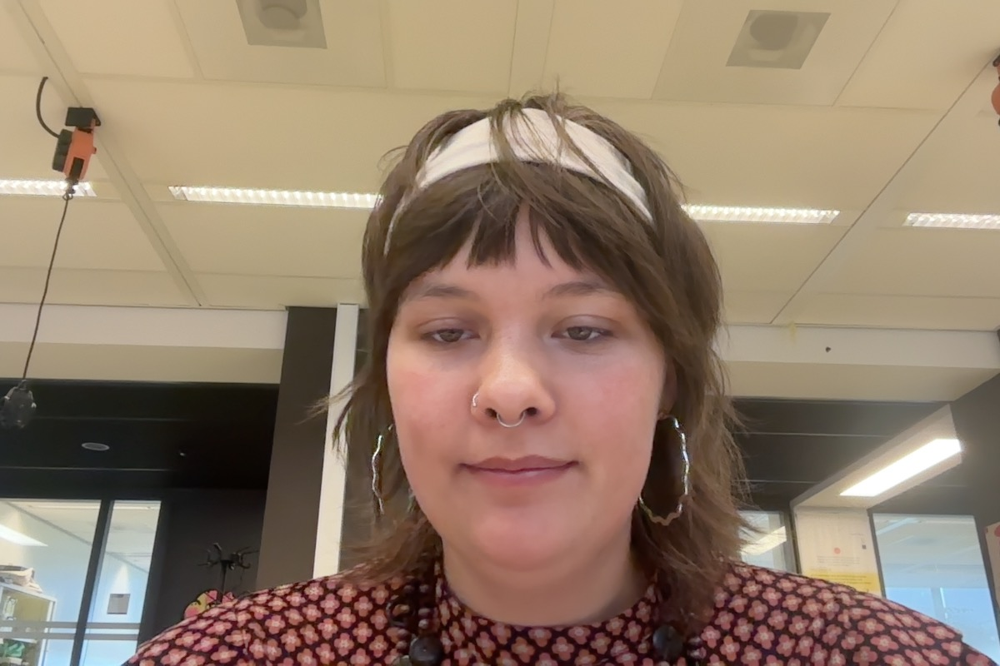

# Wat ben je van plan om vandaag te doen?
## visual thinking

- [ ] bespreking met charley
- [ ] design vragen opzetten voor cmd'er 
- [ ] code afschrijven van refactor pull-request
# Wat heb je vandaag gedaan?

* ik heb een issue [hier](https://github.com/fdnd-agency/.github/issues/8) gemaakt, waarbij ik verbeterpunten meegeef aan het `feature-request` template. ik vond hem namelijk erg irritant.
  
## Visual thinking
* ik heb een `design` label gemaakt, zodat we kunnen zien welke opdrachten UI/UX design nodig hebben.
* Ik heb [deze](https://github.com/fdnd-agency/visual-thinking/issues/356) issue geschreven. Waar onze opdracht in staat beschreven.
	* hierbij zitten ook subissues
		* https://github.com/fdnd-agency/visual-thinking/issues/361
		* https://github.com/fdnd-agency/visual-thinking/issues/362#issue-3019434948
		* https://github.com/fdnd-agency/visual-thinking/issues/363#issue-3019470750
		* https://github.com/fdnd-agency/visual-thinking/issues/365#issue-3019525533
* Wij hebben een gesprek met Charley gehad. Hier kan je vinden wat wij hebben besproken. 
# Heb je alles kunnen doen wat je *gisteren* voor ogen had?
jaa ik heb veel kunnen doen, alleen nog niet aan mijn pull-request weten te komen
- [ ] code afschrijven van refactor pull-request

* ik wil ook meer doen met mijn harold project weer, ik wil geen melk halen voor dat project
# Wat zijn handige dingen die je hebt gevonden of geleerd?
* ik zie dat je volgens mij een nieuw template kan maken voor issues? misschien handig oor ==design?== 
  
  [kan je hier vinden](https://github.com/fdnd-agency/visual-thinking/issues/templates/edit)