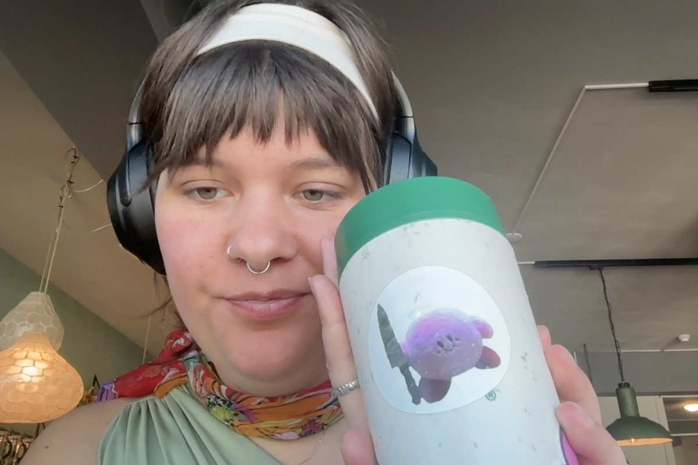

# Wat heb je vandaag gedaan?
ik heb even de dingen afgemaakt die ik eerder had geaceerd

- [x] de issue op github zetten
	- ik had even een issue gemaakt over het gesprek met charley, [die](https://github.com/fdnd-agency/visual-thinking/issues/367) staat nu online
- [ ] de juiste dingen in de planning zetten
- [x] commenten waar sander aan geassigned moet worden.
- [x] pull-request maken
	- ik heb aan [deze](https://github.com/fdnd-agency/visual-thinking/pull/368) request gewerkt en een aantal issues up-to-date gemaakt dmv updates te geven in de issues
		- ik heb een aantal dingen verholpen zie de [comments](https://github.com/fdnd-agency/visual-thinking/pull/368#issuecomment-2833461421) bij de pull-request
		- heb wat code gecorrigeerd en netlify heeft geen errors meer, damian gaat donderdag kijken naar de rest van de code
- ik heb een [update](https://github.com/orgs/fdnd-agency/projects/7/views/14?pane=info&statusUpdateId=113907) gemaakt, ==die wij kunnen inlezen na de vakantie==