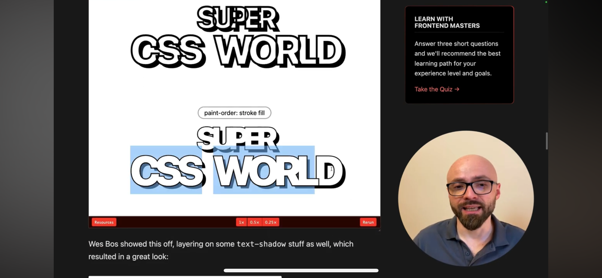

Ik heb tijdens dit blok her en der wat ontwikkelingen gevolgd op het web. Deze staan alleen een beetje overal, dus dacht ik dat ik hier een samenvatting maak van alle ontwikkelingen die ik heb gevonden tijdens dit blok

# Frontend News
Van frontend news had ik op [[dag-14-04-25]] een video gevolgd waar er meer werd toegelicht over `fill-stroke` property.

# LinkedIn
Ik merk dat ik niet zoveel lees in nieuwsbrieven, wel probeer ik zoveel mogelijk de ontwikkelingen bij te houden via LinkedIn, aangezien het daar ook veel te vinden is. 
![[Pasted image 20250609120833.png]]
Ik had tijdens dit blok een aantal linkjes achtergelaten. Hier zal ik meer toelichten wat ik in de tussentijd allemaal had geleerd.
![[Screen Recording 2025-06-09 at 13.00.16.mov]]
## Welke posts ben je tegengekomen?
Terwijl ik in de trein zit, lees ik veel over de verschillende artikelen. Hierover heb ik de volgende ontdekkingen gedaan:

### css ontwikkelingen
Ik heb een aantal nieuwe css-features ontdekt, die stijlen van website gemakkelijker maken. Ik leer onder andere veel van [@Utsav M.](https://www.linkedin.com/in/utsavmeena/), hij geeft veel updates hierover
![[Pasted image 20250609121954.png]]
#### [omgaan met light en darkmode](https://www.linkedin.com/feed/update/urn:li:activity:7331306488658829315/)
- ik had meer gelezen over hoe je kan omgaan met light- en darkmode. Ik had tijdens de studie geleerd dat je gebruik moest maken van: `@media (prefers-color-sheme: dark)`, hij vertelde in zijn artikel dat hiervoor een meer efficiënte manier voor was. 
	- waarbij je eerst de stijling meegeeft voor de lightmode, waarna de darkmode volgt. Hij definieert hier eerst de `color-sheme`dit theme veranderd. 
```css
:root {
	color-sheme: light dark;
	--bg: light-dark(white, black);  
	--text: light-dark(black, white);
}
```

![[Pasted image 20250609122356.png]]
#### [Maken van een kolom zonder grid](https://www.linkedin.com/feed/update/urn:li:activity:7332979470796046336/)
Ik had een keer een CMD'er zijn site gezien. Hij had een portfolio gemaakt waarbij hij een pinterest layout had, waar elke foto op een andere hoogte zat. Erg leuk! alleen niet erg goed opgebouwd. Hij had vier aparte rijen gemaakt en daarna een `flex` op gedaan. Toen ik een keer op LinkedIn zat te scrollen, had ik een artikel gevonden die uitlegt hoe je dit gemakkelijk bepaald.

- met `colum-width`, kan je gemakkelijk bepalen hoe breed je een kolom hebt. De browser berekent dan hoe hij de elementen hier binnenin kan plaatsen. Hierdoor kan je gemakkelijk een pinterest-layout maken.
- Hier kan je ook gemakkelijk een `gap` aan meegeven, om dit idee te maken
- Ik heb het zelf even uitgetest in [code-pen](https://codepen.io/Samarafelladina/pen/KwpXJyE), erg handig!!
![[Pasted image 20250609123322.png]]
Ik had dit nog met de CMD'er gedeeld, hij was er erg blij mee :)

![[Pasted image 20250609124535.png]]
#### [hoogte bepalen met `svh`, `lvh`, and `dvh`](https://www.linkedin.com/feed/update/urn:li:activity:7322541842237939712/)
Wat houden deze waardes in?
![[Pasted image 20250609130814.png]]
- ik heb heel vaak `vh` gebruikt, omdat ik dacht dat hij daardoor de hoogte goed bepaalde van de pagina, maar dat blijkt niet de enige waarde te zijn.
- Dit artikel vertelde alleen niet veel over de verschillen, dus had ik bij [DEV](https://dev.to/roushannn/understanding-the-different-css-viewport-units-dvh-svh-lvh-9eo)
	- `dvh`: Dynamic Viewport Height
	- `svh`: Small Viewport Heigh
	- `lvh`: Large Viewport Height
	- `vh`: Viewport 
[](https://www.linkedin.com/pulse/understanding-dvh-lvh-svh-css-prabhath-senadheera-wmvkc/)
Deze verschillende waardes kijken dus ook buiten de viewport, maar ook naar de omringende elementen.
# ​Bijhouden in logboek
op [[dag-02-05-25]], had ik een aantal linkjes snel genoteerd, dit was wat ik er precies van had geleerd
## [canva code vs developers](https://www.linkedin.com/posts/latoyanijmeijer_canva-code-vs-developers-the-beginning-activity-7317646650712162305-22Gz/?utm_source=share&utm_medium=member_desktop&rcm=ACoAADtV6GgBkjOrbmNyJquqp06WzzYRyuV9180)
[canva code vs developers](https://www.linkedin.com/posts/latoyanijmeijer_canva-code-vs-developers-the-beginning-activity-7317646650712162305-22Gz/?utm_source=share&utm_medium=member_desktop&rcm=ACoAADtV6GgBkjOrbmNyJquqp06WzzYRyuV9180), is een applicatie was canva heeft uitgebracht waarbij mensen visuele interfaces kunnen uploaden, waarna een ai het gaat coderen voor hun. Toen ik dit voor het eerst zag schrok ik, want ik heb net twee jaar gestudeerd en dan nu dit 💀.
- Ik had als allereerst gelezen over dat ai natuurlijk nooit iets nieuws kan ontwikkelen
- maar daarnaast ook dat het heel erg belangrijk is om jezelf uniek te maken voor de markt, waardoor je kan worden ingezet op een manier waar mensen niet afhankelijk kunnen zijn van ai
- Canva biedt al langer tools aan voor kleine bedrijven om gemakkelijk een website op te zetten, eigenlijk net zoals Elementor. 
- Het is wel waarschijnlijk wanneer een bedrijf groter word, dat er een developer nodig is. Dus het blijft nodig. 
- Wel leert canva haar ai om te gaan met accessibility en performance, waardoor deze service erg efficiënt kan werken voor deze markt. 
- Toch blijft het voor nu zijn nadelen hebben. Wel is het belangrijk om bewust te blijven van deze veranderingen en jezelf te verdiepen in de fundamentele onderwerpen van het web om jezelf zo een unieke rol te bieden in deze markt.

![[Pasted image 20250609121212.png]]
## Delen van sites en tools
Tijdens dit blok hebben veel klasgenoten en docenten sites met mij gedeeld, deze heb ik dan ook genoteerd om mee te nemen en bij stil te staan.
### delen van mooie (portfolio) sites
 ook heb ik notaties gemaakt van interessante sites die mensen met mij hebben gedeeld. Ik heb deze opgeslagen om zo meer inspiratie in het algemeen op te doen, maar ook voor mijn portfolio site
- op [[dag-26-05-25]] had Damian mij een aantal mooie sites laten zien die ik heb opgeschreven. 
	- https://www.martinukhanov.dev
	- https://otfnk.com
- op [[dag-06-05-25]] had Robin een aantal links met mij gedeeld. Hij liet een website zien genaamd [anime.js](https://animejs.com/documentation/timer/timer-callbacks). Ik had plannen om dit mee te nemen bij het bouwen van mijn portfolio. Verder had hij de volgende links met mij gedeeld:
	* https://www.dora.run/
		* https://3d-hatduck.dora.run/
* Op [[dag-21-05-25]] vertelde Justus dat hij in het *Internet Phone book* is gekomen. Dit is een boek waarin verschillende nummers staan van Digital gardens. Erg leuk
	- [bel iemand](https://internetphonebook.net/#dial-a-site)
![[IMG_7566.jpeg]]

![[IMG_7567.jpeg]]
## Werken met variabelen in Figma
Anna-kyra had mij op verschillende momenten informatie gedeeld over hoe je met variablen kan omgaan in Figma.
- zo had zij een [issue](https://github.com/fdnd-agency/.github/issues/11) voor FDND agency hoe je dit kan hanteren ([[dag-21-05-25]])
- op [[dag-26-05-25]] had ze ook een link [gedeeld](https://www.figma.com/community/file/1000026521402926606) van een style guide die dit op een mooie manier hanteert
![[Pasted image 20250609132344.png]]
## Icon library
op [[dag-21-05-25]] Robin had met mijn een hele leuke Icon libray gedeeld die op verschillende termen reageert. 
![[Pasted image 20250609131912.png]]
### [gov.uk](https://design-system.service.gov.uk/styles/)
[[dag-22-05-25]] Had Sanne mij meer verteld over toegankelijkheid op het web. Sanne liet mij een toegankelijk site zien van de overheid van de UK, hele mooie site! Erg toegankelijk maakt me erg blij. Deze site voldoet aan de richtlijnen van het web. Zo vertelde bij ook dat de rijksoverheidsites hier enorm op afkijkt. Erg interessant om te kijken hoe hun voldoen aan de richtlijnen van het web. 
- hier is de styleguide van [gov.uk](https://design-system.service.gov.uk/styles/)
- [accessibility](https://design-system.service.gov.uk/accessibility/accessibility-strategy/)
![[Pasted image 20250609115916.png]]